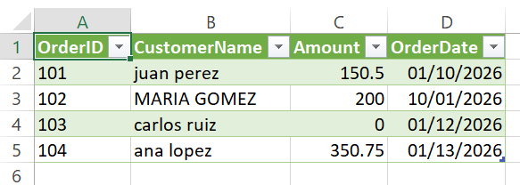

## Project Visual Results

Here is a visual comparison of the data before and after the automated cleaning process:

|            Before Cleaning (Raw Data)            |    After Cleaning (Transformed Data)    |
| :----------------------------------------------: | :-------------------------------------: |
|  |  |

_Notice how the date format is standardized, errors are handled, and the structure is ready for analysis._
