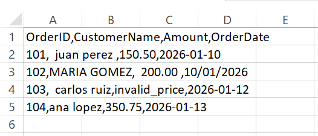
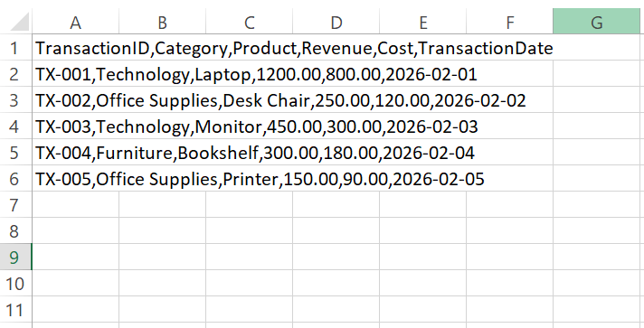
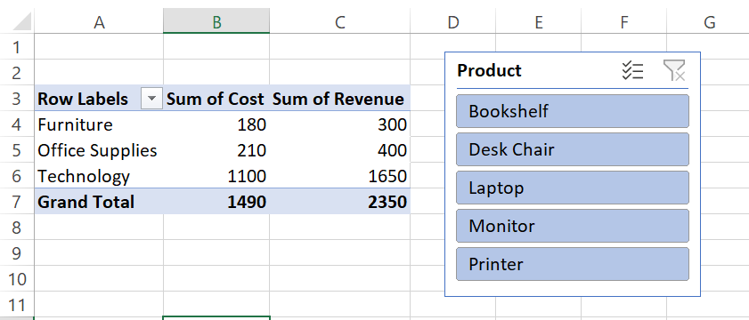

# Excel Automation & Data Portfolio

Welcome to my professional data automation portfolio. This repository showcases real-world business problems solved using Microsoft Excel, Power Query, and advanced data structuring techniques to eliminate manual, repetitive tasks.

---

## 🛠 Technologies Used

- **Microsoft Excel:** Advanced data modeling, formatting, and analysis.
- **Power Query (ETL):** Automated data extraction, transformation, and loading.
- **Pivot Tables & Slicers:** Dynamic data aggregation and executive filtering.
- **Git & GitHub:** Version control, professional commit history, and repository documentation.

---

## 📂 Project Structure

```text
excel-portfolio/
│
├── README.md                          # Main portfolio overview (You are here)
│
├── 01_Data_Cleaning_Transformation/   # Project 1: Automated ETL Pipeline
│   ├── assets/                        # Visual assets and screenshots for documentation
│   ├── data_raw/                      # Unformatted raw input data
│   ├── data_clean/                    # Processed & automated output files
│   └── README_Project1.md             # Detailed breakdown of Project 1
│
├── 02_Financial_Dashboard/            # Project 2: Advanced KPIs & Slicers
│   ├── assets/                        # Visual assets and screenshots for documentation
│   ├── dashboard/                     # Main workbook with Pivot Tables & Slicers
│   ├── data/                          # Raw financial transaction logs
│   └── README_Project2.md             # Detailed breakdown of Project 2
│
├── 03_VBA_Automation/                 # Project 3: Macro-driven Automation (Coming Soon)
└── 04_Inventory_Control/              # Project 4: Dynamic Inventory & Alerts (Coming Soon)
```

## 🚀 Projects Overview & Problems Solved

### 1. Automated Data Cleaning Pipeline (`01_Data_Cleaning_Transformation/`)

- **Problem Addressed:** Manual data scrubbing is repetitive, error-prone, and wastes hours of valuable analytical time every week.
- **Solution:** Built an automated ETL pipeline using Power Query that cleans whitespace, standardizes dates, and handles data type errors instantly with a single click.
- **Documentation:** Read the deep-dive inside [README_Project1.md](01_Data_Cleaning_Transformation/README_Project1.md).

### 2. Interactive Financial Dashboard (`02_Financial_Dashboard/`)

- **Problem Addressed:** Executives lack real-time visibility into revenues, costs, and profit margins, relying on static tables that require manual filtering.

- **Solution:** Developed an interactive executive dashboard using Pivot Tables and visual Slicers to filter complex financial data instantly.

- **Documentation:** Read the deep-dive inside [README_Project2.md](02_Financial_Dashboard/README_Project2.md)

---

## 📊 Project Visual Results & Previews

### Project 1: Data Cleaning (Before vs. After)

Here is a visual comparison of the data before and after the automated cleaning process:

|                            Before Cleaning (Raw Data)                            |                    After Cleaning (Transformed Data)                    |
| :------------------------------------------------------------------------------: | :---------------------------------------------------------------------: |
|  |  |

_Notice how the date format is standardized, errors are handled, and the structure is ready for analysis._

---

### Project 2: Financial Dashboard Preview

Executive Interactive Dashboard with Slicers

|                      Before Dashboard (Raw Data)                       |                       After Dashboard (financial dashboard)                        |
| :--------------------------------------------------------------------: | :--------------------------------------------------------------------------------: |
|  |  |

## 💡 Future Improvements

- Integrate advanced DAX measures for automated financial metrics.
- Expand macro scripts to automatically email generated reports.

---

## 🔮 Future Roadmap

- **Project 3: VBA Macro Automation (Coming Soon)**
  - _Focus:_ Developing custom macro scripts to automate repetitive report generation and streamline email distribution.
- **Project 4: Dynamic Inventory Control System (Coming Soon)**
  - _Focus:_ Building real-time stock tracking with automated low-stock alerts and conditional formatting triggers.

---

## 📬 Contact

- **Author:** Jetzel Adjel Quintero Bill
- **GitHub:** [@JetzelQuintero](https://github.com/JetzelQuintero)
- **Email:** jetzel.quintero.it@gmail.com
